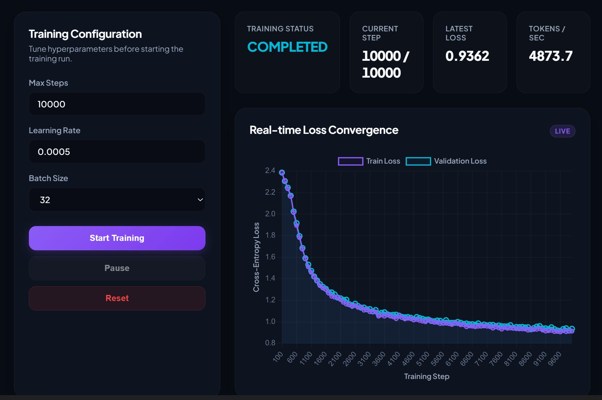
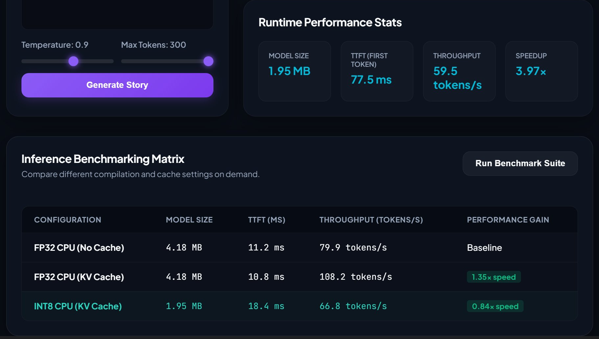

# ForgeLM

<h3 align="center">Transformer Inference Engine Built From Scratch</h3>

<p align="center">
A GPT-style decoder-only Transformer trained on TinyStories and engineered to explore the systems behind modern LLM inference: self-attention, KV caching, quantization, benchmarking, and serving.
</p>

<p align="center">
  
  
  
  
  
  
  
  
  
</p>

---

## Project Dashboard

<p align="center">
  
  
</p>

---

## Overview

ForgeLM is a decoder-only Transformer language model implemented entirely from first principles.

Unlike typical GPT hobby projects that focus solely on training, ForgeLM focuses on the engineering systems that power real-world LLM inference:

* Multi-Head Self-Attention
* Autoregressive Decoding
* KV Cache Optimization
* Dynamic INT8 Quantization
* Throughput & Latency Benchmarking
* FastAPI Model Serving
* Interactive Monitoring Dashboard

Every component was built, profiled, benchmarked, and analyzed to understand the performance tradeoffs behind modern language model systems.

---

## Key Results

✅ Trained a GPT-style Transformer from scratch on TinyStories

✅ Implemented Multi-Head Self-Attention and Causal Masking

✅ Built KV Cache for accelerated autoregressive decoding

✅ Reduced model size by 53% using Dynamic INT8 Quantization

✅ Created a FastAPI-based inference server

✅ Developed a real-time training & benchmarking dashboard

✅ Benchmarked TTFT, throughput, memory footprint, and optimization tradeoffs

---

## Benchmark Results

| Configuration   | Model Size | TTFT (ms) | Throughput (tok/s) |
| --------------- | ---------: | --------: | -----------------: |
| FP32 CPU        |    4.18 MB |      11.2 |               79.9 |
| FP32 + KV Cache |    4.18 MB |      10.8 |              108.2 |
| INT8 + KV Cache |    1.95 MB |      18.4 |               66.8 |

### Key Findings

* KV Cache improved generation throughput by approximately **35%**
* Dynamic INT8 Quantization reduced model size by **53%**
* Quantized inference was slower on CPU due to dequantization overhead
* Demonstrated practical memory vs latency tradeoffs in LLM deployment

---

## Engineering Motivation

Most developers can use a language model API.

Far fewer understand:

* How self-attention computes context
* Why causal masking enables autoregressive generation
* Why KV caching is critical for efficient decoding
* When quantization helps and when it hurts
* How throughput and latency are measured in production systems

ForgeLM was built to explore those engineering challenges through implementation, experimentation, and benchmarking.

---

## Training Results

### Loss Convergence

<p align="center">
  
</p>

Training performed on the TinyStories dataset using a compact GPT-style architecture.

| Metric         | Value  |
| -------------- | ------ |
| Training Steps | 10,000 |
| Final Loss     | 0.936  |
| Batch Size     | 32     |
| Learning Rate  | 5e-4   |

Training and validation curves remain closely aligned, indicating stable optimization and minimal overfitting.

---

## Sample Generation

Prompt:

```text
Once upon a time
```

Generated:

```text
Once upon a time, there was a look on the door.
It was friend, a little girl named Lily.
She loved to play with her friends, and they were all always they said there.
One day, Lily's mom came over to play with her princess in the swings...
```

Despite having only ~500K parameters, the model learns:

* Sentence structure
* Grammar patterns
* Story formatting
* Punctuation rhythm
* Basic narrative flow

---

## Core Optimizations

### KV Cache

Standard autoregressive decoding repeatedly recomputes attention over the full sequence for every generated token.

ForgeLM implements a Key-Value Cache that stores historical attention states and reuses them during generation.

**Benefits**

* Eliminates redundant computation
* Improves decoding throughput
* Scales more efficiently with longer contexts

---

### Dynamic INT8 Quantization

ForgeLM applies post-training dynamic quantization to Linear layers.

**Benefits**

* Reduced model memory footprint
* Faster model loading
* Lower storage requirements

**Observation**

For small CPU workloads, quantization introduced dequantization overhead that outweighed compute savings, highlighting the importance of hardware-aware optimization.

---

## Architecture

```text
Input Tokens
      │
      ▼
Token Embeddings
      │
      ▼
Positional Encoding
      │
      ▼
Transformer Blocks × N
      │
      ├── Multi-Head Self-Attention
      ├── Causal Masking
      ├── KV Cache
      ├── Feed Forward Network (GELU)
      ├── Layer Normalization
      └── Residual Connections
      │
      ▼
Linear Language Modeling Head
      │
      ▼
Token Sampling
      │
      ▼
Generated Text
```

---

## Technical Highlights

### Transformer Implementation

* Decoder-only GPT architecture
* Token embeddings
* Positional encodings
* Multi-head self-attention
* Causal masking
* Layer normalization
* Residual connections
* GELU feed-forward layers

### Generation Engine

* Greedy decoding
* Top-k sampling
* Top-p (nucleus) sampling
* Temperature scaling

### Inference Optimizations

* KV Cache decoding
* Dynamic INT8 quantization
* CPU/GPU benchmarking
* Throughput measurement
* TTFT analysis

### Serving Infrastructure

* FastAPI backend
* Streaming generation
* REST endpoints
* Dashboard integration

---

## Project Structure

```text
ForgeLM/
│
├── src/
│   ├── transformer/
│   ├── training/
│   ├── inference/
│   ├── optimization/
│   └── serving/
│
├── benchmarks/
│
├── tests/
│
├── assets/
│   ├── training-dashboard.png
│   └── benchmark-dashboard.png
│
├── requirements.txt
├── NOTES.md
└── README.md
```

---

## Quick Start

### Clone Repository

```bash
git clone https://github.com/yourusername/ForgeLM.git
cd ForgeLM
```

### Install Dependencies

```bash
pip install -r requirements.txt
```

### Train Model

```bash
python train.py
```

### Generate Text

```bash
python generate.py
```

### Run Benchmarks

```bash
python benchmarks/run_benchmarks.py
```

### Launch Server

```bash
uvicorn serve.api:app --reload
```

---

## Future Improvements

* Flash Attention
* FP16 / BF16 Inference
* BPE Tokenization
* ONNX Export
* TensorRT Deployment
* Speculative Decoding
* Distributed Inference
* Multi-GPU Serving

---

## Lessons Learned

Through building ForgeLM, I explored:

* Attention mechanics
* Efficient autoregressive decoding
* Quantization tradeoffs
* Benchmark design
* Model serving infrastructure
* Latency vs throughput optimization
* Real-world inference engineering

---

## License

MIT License
